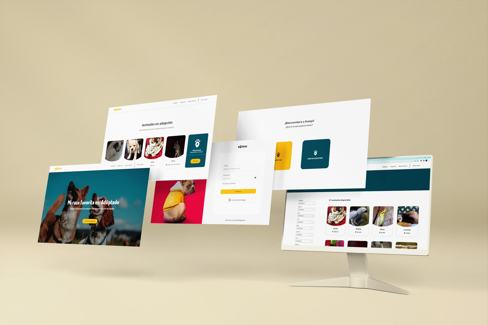

<h1 align="center">
Atteneri González Mendoza
 
  
</h1>

<h3>Hi there!</h3>
<h3>I'm a girl from Canary Islands who's lover of everything but fanatic of nothing</h3>
  

🔸I'm currently working on 'Organiclub' and 'Luxel' user interfaces. Soon!

🔸I'm currently improving my skills on UI/UX.

🔸I'm looking for a job that get me new knowledge and allow me to continue exploring this profesion through passion and creativity.

🔸2023 Goals: Contribute with good projects and discover new places.

🔸Fun fact: I love travel, read, acting and of course eat :)

  
<h4 align="left">Conect with me:</h4>

  
  
  

 

<h2>👾 Main Technologies</h2>

 

  
  
  
  
  
  
  
  
  
  
  
  
  
  
  
  
  
  
  
  
  
   

 

<h2>👾 Last Projects</h2>

 

 

Kompi is an app designed to connect people who want to adopt pets in Spain. 
Developed in two months by Karmic Koala team as final project in EOI Front-End Programming and Web Design department. My role was work as developer and graphic designer creating the visual identity and the web layout.

HTML5 || CSS3 || JavaScript || Vue.js || Node.js || Git || Netlify || Firebase || Google Analytics || Figma || Illustrator || Photoshop 

 

  

 

<h2>👾 Github Stats</h2>

 

  

    
   <!-- 
     
    <i><b>Note:</b> Top languages is only a metric of the languages my public code consists of and doesn't reflect experience or skill level.</i> -->
  

   

  

    <!--  -->

  

 

 

  

