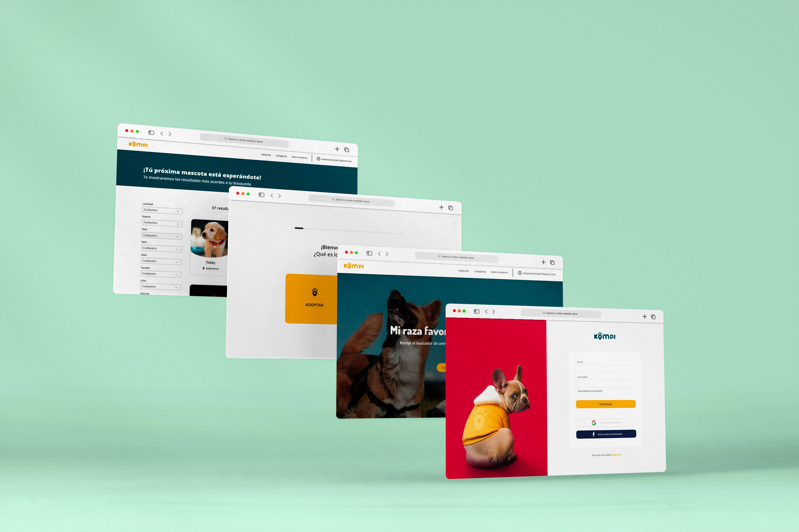

<h1 align="center">
Atteneri González Mendoza
   
  
</h1>

 

  
  

  

<h2>⚡ Main Technologies</h2>

 

  
  
  
  
  
  
  
  
  
  
  
  
  
  
  
  
  
  
  
  
  
   

 

<h2>⚡ Last Projects</h2>

 

   
 Kompi is a platform designed to connect people looking to adopt pets within the Spanish national territory.

 Developed by the Karmic Koala team as a final project of the EOI Front-End Programming and Web Design Course.

HTML5 || CSS3 || JavaScript || Vue.js || Node.js || Git || Netlify || Firebase || Google Analytics
 

  

 

<h2>⚡ Github Stats</h2>

 

  

    
   <!-- 
     
    <i><b>Note:</b> Top languages is only a metric of the languages my public code consists of and doesn't reflect experience or skill level.</i> -->
  

   

  

    
  

 

 

  

